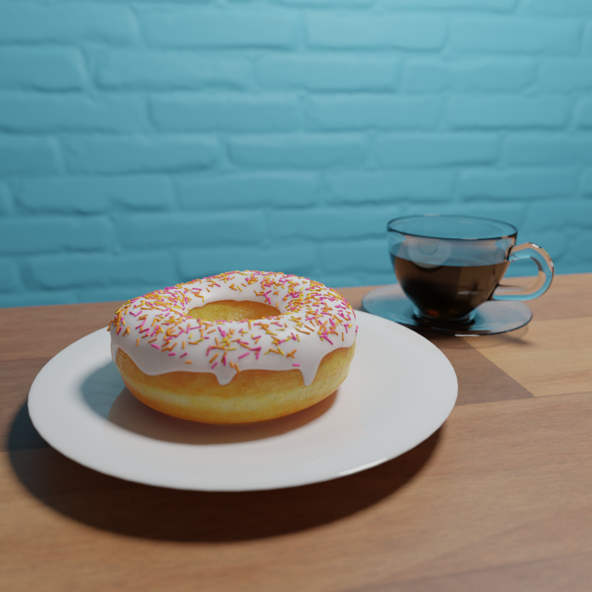
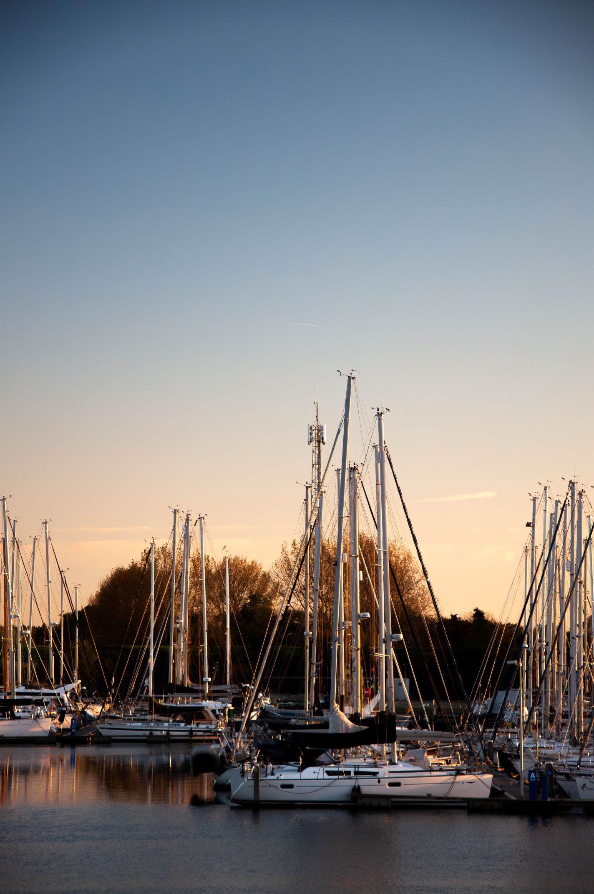

# Me as a photographer

### Where it started

During the great lockdown of 2020, I felt bored. (Not like everyone felt that way) That's when I discovered photography, the art of taking photos. Although I first just started taking pictures of nature, or food, or cool things on vacation, it wasn't really an art for me yet. I used my phone to take these photos and used basic instagram filters to manipulate the colors a bit. I did however have a Nikon D90 laying around, which I inherited from a passed family member. I started learning about the basics: Exposure, Aperture and Shutter speed. I applied these principles to my photography using this camera and this is what turned photography into an art for me.

### Evolution

Since then, I have been taking photos whenever I had the opportunity for beautiful shots and shared them on my instagram <a href="https://instagram.com/jasperdg_photography" target="_blank">@jasperdg_photography</a>. (Used to be jdg_be) During this time, I also started experimenting with the 3D-program Blender. You might find a few works, but I haven't used it in some time. My instagram-account was known for its typical donut, which I created while learning Blender using a common youtube-tutorial series. A few personal photo-highlights in my journey would be:
-  <b>The atomium</b> <i>(August 2022 - Brussels,<b class="flag">🇧🇪</b>)</i>
-  <b>A drone-photo of the sea</b><i> (November 2022 - Cadzand, <b class="flag">🇳🇱</b>) </i>
-  <b>Frozen plants in the winter</b><i> (December 2022 - Wichelen, <b class="flag">🇧🇪</b>)</i>
-  <b>The beautiful sea of greece</b><i> (July 2023 - Crete, <b class="flag">🇬🇷</b>) - I ended up using this photo in my DJ-logo</i>
-  <b>A long-exposure shot of the Amsterdam Metro</b><i> (February 2024, Amsterdam, <b class="flag">🇳🇱</b>)</i>
-  <b>The St. Joseph church in Ghent</b><i> (July 2024 - Ghent, <b class="flag">🇧🇪</b>)</i>
-  <b>The lake of Bled</b><i> (August 2024 - Bled, <b class="flag">🇸🇮</b>)</i>
-  <b>Some boats</b><i> (October 2024 - Den Osse, <b class="flag">🇳🇱</b>)</i>

 

### Where I stand now

In December 2024, I acquired my first full-frame camera, the Sony α7iii together with its 28-70mm f/3.5-5.6 OSS kit-lens. This allows me to take pictures in better quality and maybe start doing videography too. (The D90 only allowed 720p recording for a maximum of 5 minutes) I'm also renaming my instagram account to make it more focused on my photography and I seperated my personal account. This allows me to have flexibility and take full control over what I post as a professional photographer. 

I'm always on the lookout for new opportunities, be sure to contact me!

